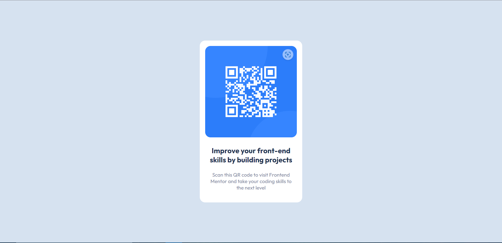

# Frontend Mentor - QR code component solution

This is a solution to the [QR code component challenge on Frontend Mentor](https://www.frontendmentor.io/challenges/qr-code-component-iux_sIO_H). Frontend Mentor challenges help you improve your coding skills by building realistic projects. 

## Table of contents

- [Overview](#overview)
  - [Screenshot](#screenshot)
  - [Links](#links)
- [My process](#my-process)
  - [Built with](#built-with)
  - [What I learned](#what-i-learned)
- [Author](#author)
- [Acknowledgments](#acknowledgments)

**Note: Delete this note and update the table of contents based on what sections you keep.**

## Overview

### Screenshot




### Links

- Live Site URL: [QR-Code Component](https://baayeh.github.io/qr-code-component/)

## My process

### Built with

- Semantic HTML5 markup
- CSS custom properties
- Flexbox
- Mobile-first workflow


### What I learned

I learned how to center an element using flexbox

```html
<main>
    <div class="qr-card">
      <div class="qr-img">
        
      </div>
      <div class="card-body">
        <h3 class="card-title">Improve your front-end <br > skills by building projects</h3>
        <p class="card-text">
          Scan this QR code to visit Frontend <br> Mentor and take your coding skills to <br> the next level
        </p>
      </div>
    </div>
  </main>
```
```css
main {
  background-color: hsl(212, 45%, 89%);
  display: flex;
  justify-content: center;
  align-items: center;
  width: 100%;
  height: 100vh;
}
```

## Author

- Website - [Kwasi Antwi Baayeh](https://baayeh.github.io/portfolio/)
- Frontend Mentor - [@Baayeh](https://www.frontendmentor.io/profile/Baayeh)
- Twitter - [@Cest_Baayeh](https://twitter.com/Cest_Baayeh)


## Acknowledgments

- Frontend Mentor
